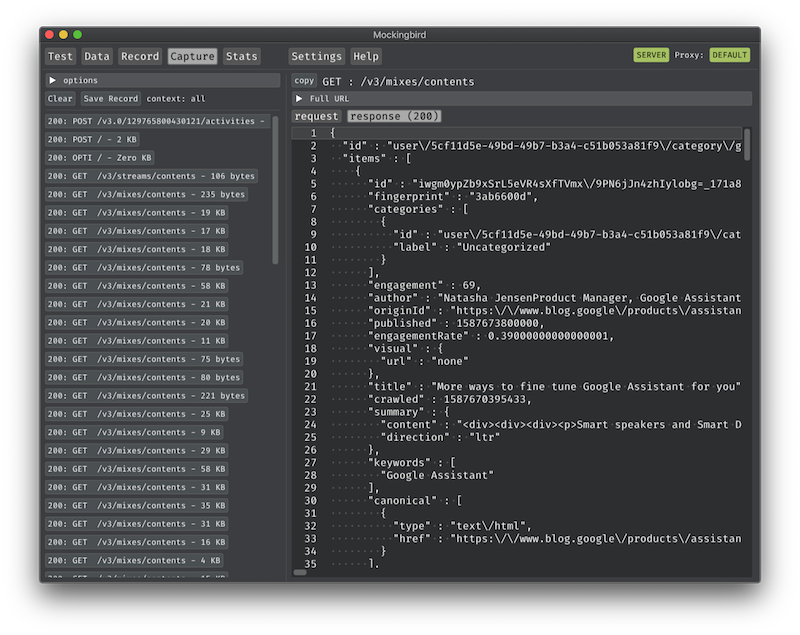

<center>


[](LICENSE)
[](https://swift.org/download)
[](https://developer.apple.com/platforms/)
[](https://github.com/Carthage/Carthage)

</center>

# Mockingbird



Mockingbird was designed to simplify software testing, by easily mocking any system using HTTP/HTTPS, allowing a team to test and develop against a service that is not complete or is unstable or just to reproduce planned/edge cases.

## Features

* Well designed and easy user interface, focusing on data manipulation
* Definition of test scenarios with their respective data mocks
* Easily create new data mocks using json file with a simple schema
* On the fly data manipulation
* Monitor and analyse captured decoded transactions so can be analyzed properly (payload, headers, etc)
* Mocked data can be easily spotted while capturing and analyzing data
* Snapshot automatic generation using already made captures, just tapping one button (Record)
* Saved snapshots can be used to replay a recorded scenario easily
* Real-time traffic analysis, giving good insights from data usage

### Requeriments

In order to use this tool you need MITMProxy installed through Homebrew.

1. Install [MITMProxy](https://mitmproxy.org/) if you don't already have it.

    ```
    brew install mitmproxy
    ```

## Installation

#### Binary downloads

Oficial binaries can be founded on 'Release Page'

#### Compiling

Follow these steps to compile:

1. Clone this repo to your Mac.

    ```
    git clone https://xxxx...

    cd Mockingbird/src
    ```

2. Install [Carthage](https://github.com/Carthage/Carthage) if you don't already have it.

    ```
    brew install carthage
    ```

3. Retrieve and build dependencies.

    ```
    carthage bootstrap --platform Mac
    ```

4. Open the project file in Xcode then build and run.

    ```
    open Mockingbird.xcodeproj
    ```

## Usage

Documentation and tutorials can be found on 'Wiki Page'

## Contributing

Read the [Contributing guidelines](CONTRIBUTING.md)

## Maintainers

* @erickjung

## License

 [MIT](LICENSE)
